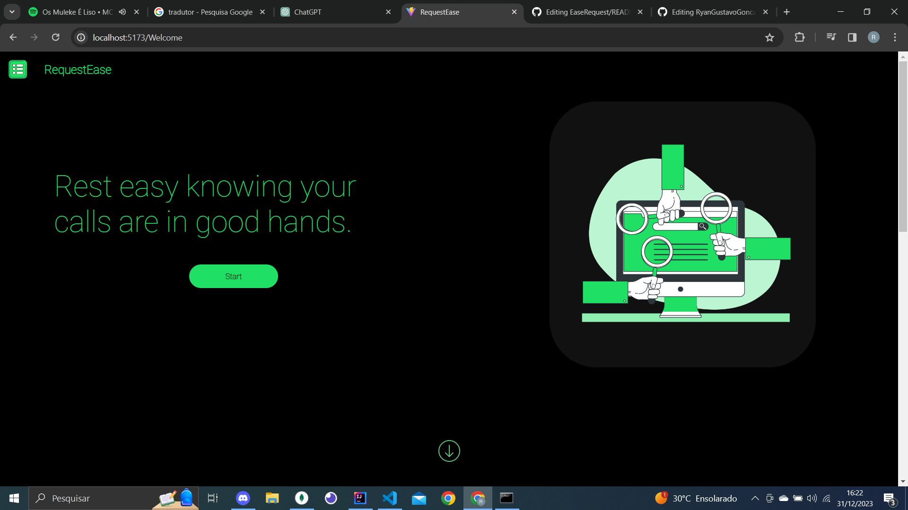
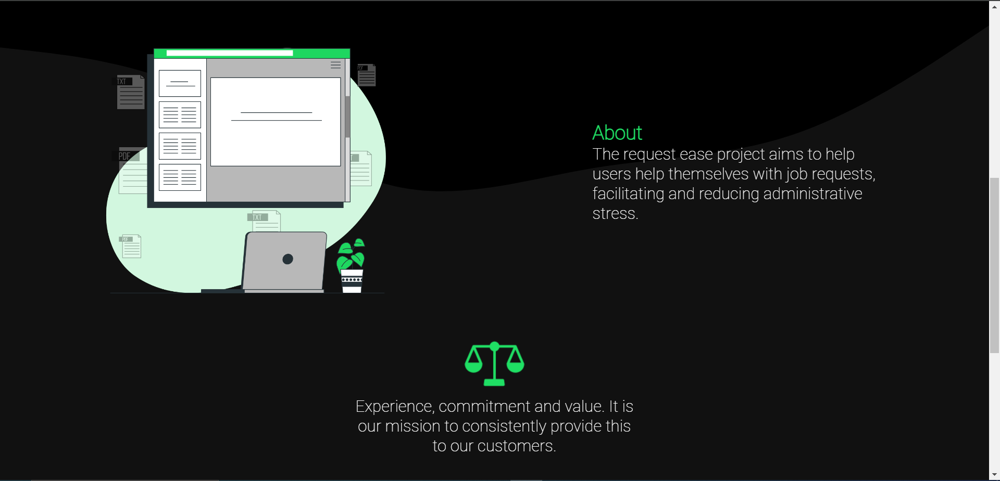
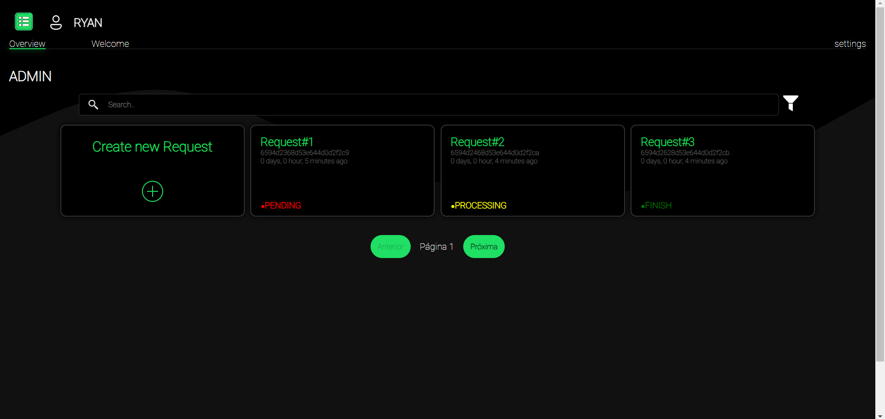

# EaseRequest 🚀

# [](https://skillicons.dev)

EaseRequest é uma aplicação web construída com React (Vite), Java Spring (backend), e MongoDB para facilitar a gestão de solicitações de usuários. Permite que os usuários criem, atualizem e excluam solicitações, com atualizações em tempo real sobre o status das solicitações. A aplicação possui uma interface amigável com modais para interações simples.

## Novas Funcionalidades 🌟
✉️ **Notificações por E-mail**: Agora, EaseRequest oferece uma funcionalidade de envio de e-mail para a atualização de senha e finalização de uma request. Ao solicitar uma alteração de senha, os usuários recebem um e-mail com um token para confirmação.

🐍 **Integração Python**: Adicionamos uma nova camada ao EaseRequest com um script em Python para pegar informações de solicitações da aplicação e jogar em planilhas de excel. Isso permite uma maior flexibilidade na manipulação de dados e relatórios.

📊  **Excel File Generator**: Desenvolvemos um endpoint em Java que permite a geração de arquivos Excel personalizados com base nas suas solicitações! Para os administradores, implementamos uma funcionalidade extra: a criação de um arquivo Excel abrangendo todas as solicitações.

## Recursos

✨ **Atualizações em Tempo Real**: Receba atualizações ao vivo sobre o status das suas solicitações.

📝 **Criar, Atualizar, Excluir**: Gerencie facilmente suas solicitações com ações simples.

🔍 **Funcionalidade de Busca**: Encontre rapidamente solicitações específicas com a função de busca.

📆 **Acompanhamento de Tempo**: Veja quanto tempo atrás uma solicitação foi criada.

## Tecnologias Utilizadas

- **Frontend**: React (Vite)
- **Backend**: Java Spring
- **Banco de Dados**: MongoDB

## Começando

### Pré-requisitos

Certifique-se de ter o [Node.js](https://nodejs.org/) instalado na sua máquina.

### Instalação

1. Clone o repositório:

```bash
git clone https://github.com/RyanGustavoGoncalves/EaseRequest.git
```

2. Navegue até o diretório do projeto:

```bash
cd EaseRequest
```

3. Instale as dependências:

```bash
npm install
```

4. Inicie o servidor de desenvolvimento:

```bash
npm run dev
```

5. Abra seu navegador e vá para [http://localhost:5173].

6. Explore o EaseRequest e gerencie suas solicitações facilmente!

## Configuração do Backend

Certifique-se de ter o ambiente Java e MongoDB configurados para executar o backend. Consulte a documentação do Java Spring e do MongoDB para obter mais informações.

## Capturas de Tela







## Contribuições

Contribuições são bem-vindas! Sinta-se à vontade para abrir problemas e solicitações de pull.

## Agradecimentos

- Um agradecimento especial ao [React](https://reactjs.org/), [Vite](https://vitejs.dev/), Java Spring, e MongoDB por tornarem este projeto possível.

Obrigado por usar o EaseRequest! 🌟
